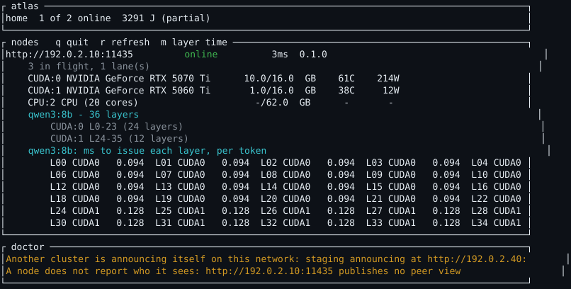
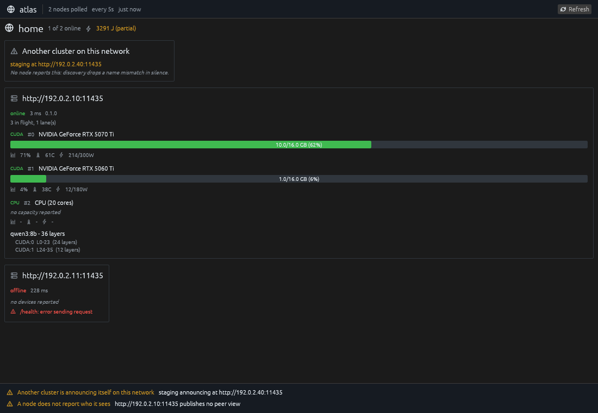

# atlas

Watch a loken cluster: what each node holds, what it measures, and where they disagree.

```
cargo build --release
```

## What it does

Three tools over one collector.

- **`atlas watch`** - the living map. Nodes, their devices, the models resident on each with
  the layers every device holds, what is in flight, the round trips between them, and the
  doctor's verdict in words. A node that reports no device says so rather than leaving a
  blank.
- **`atlas doctor`** - the inconsistencies a cluster swallows in silence, each as a sentence
  naming the nodes by their id. Exits with the number of rules that fired.
- **`atlas export`** - OpenMetrics for the facts no single node holds: round trips as the
  observer measures them, membership, versions, and doctor's verdicts.

`atlas-gui` draws the same state and takes the same flags. Two views of one cluster, not two
tools: a second collector would mean a second model of the cluster, and two models drift.





Both images are rendered by the test suite, driving the same code the binaries run, from a
snapshot written in `src/screenshots.rs` - so they show the current layout and can show no real
address, host or model. Regenerate them with
`cargo test --release --all-features screenshots -- --ignored`.

Node addresses come from `--node`, from a config file, or from listening. None are compiled in.
A bare `host:port` is taken as `http://`, and both binaries listen for announcements before
deciding they have no node to watch. The same daemon reached at two addresses, `localhost` and
the one it advertises, is one node: nodes are told apart by the id they give themselves.

## What doctor reports

| Finding | What it means |
|---|---|
| Another cluster is announcing itself on this network | Only a passive listener can see it: every node drops a name mismatch in silence |
| Two nodes share one id | Each hides the other, since a node filters its own announcements on that id |
| The nodes do not all see each other | A partition where both halves still answer the observer |
| A node does not report who it sees | A build older than the peers route |
| A node publishes no catalogue | The router then prices it on what it has in memory alone |
| Energy is reported on part of the cluster only | Any cluster total would be partial |
| A node answers but is not in a cluster | It runs without a `[cluster]` block |
| The nodes run different versions | |

Nodes holding different models is not a finding. Models spread over the cluster and a request
is forwarded to a holder; that is the cluster working as designed.

## Where it is careful

**atlas never announces itself.** A probe that joins the discovery group becomes a peer the
router can hand work to.

**`/api/cluster/state` is polled slowly.** The round trip of that request is what the router
uses to price a hand-over, so hammering it inflates the measured latency of the node it
describes and biases routing away from a peer that is fine. An observer that changes what it
observes is not observing. `/api/stage_perf` is never polled at all: it is a global toggle that
resets counters.

**`0.0` means never measured, not zero.** Every rate a node publishes uses zero for unknown -
the server says so explicitly, because when both nodes report zero every candidate ties at
infinity. Printing `0 tok/s` states a number the engine went out of its way not to mean, so
atlas prints `-`.

**`serves: null` is not `serves: []`.** Null is a node that did not say; empty is a node that
serves nothing. Collapsing them makes a weightless node look like an unknown one.

**A partial energy total says so.** Where reporting is off on any node, no cluster total is
emitted rather than a sum that reads as complete.

**The round trip is taken on the request already being made**, never on a separate ping, which
would measure a path the router does not price.

## Building

`cargo build --release` builds both binaries; `--no-default-features` builds `atlas` alone,
without the window and its display stack. The minimum toolchain is the one the window's
libraries require, stated in `Cargo.toml`; the workflow checks it, along with formatting, the
lints, the tests, the documentation and the dependency audit.

## Licence

MIT or Apache-2.0, at your option.
